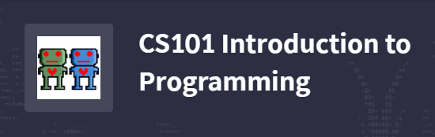
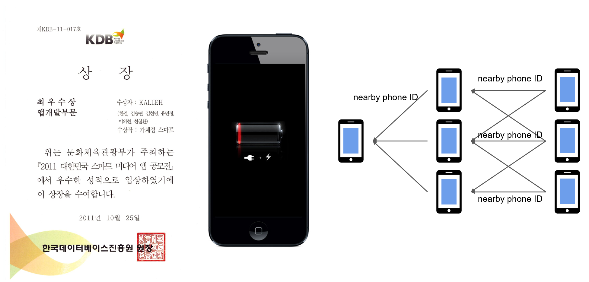

# TEMP Title

---

@snap[west span-45]
## GSIS MS 17
## Euihyun Lee
@snapend

@snap[east span-55]

@snapend

---

@snap[north-west]
## I have worked with these...
@snapend

@snap[west span-65]
@ul
- Python
- Android
- TensorFlow & PyTorch
- QEMU
@ulend
@snapend

@snap[east span-35]

@snapend

@snap[south-east]
# @size[0.1em](Logos from python.org, developer.android.com, tensorflow.org, pytorch.org, and qemu.org)
@snapend

---

@snap[north-west]
## Python: 
## Undergraduate Course TA
@snapend

@snap[west span-55]
## *Since 2012~*
@snapend

@snap[east span-45]

@snapend

@snap[south-east]
# @size[0.1em](Logo from kaist.elice.io)
@snapend

---

## Android: Successful Works

@snap[south-east]
# @size[0.1em](battery run-out image from buyijet.com)
@snapend

